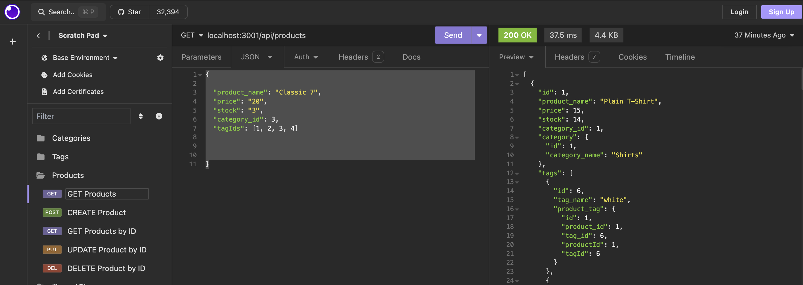

# E-Commerce-Management

## Building an ECommerce Management System

The purpose of this project is to create a database using Sequelize. In the database, four models are created and they are: Category, Product, ProductTag, and Tag. Developing this project demonstrates our back-end development skills using Mysql2, Nodejs, Express js, Dotenv, and Sequelize.

This project was developed with Sequelize version ^5.22.5 Using Sequelize assisted in forming and structuring of the database models. Along with forming the models, Sequelize was used for seeding, and the management of data. Insomnia was used to implement Express js methods.

The following is an image of the data output from a method request made using Express js in Insomnia.

The Following image is example of the data retrieved from Insomnia used to create and/or access the data.

## Installation

N/A

## Usage

To view the application in action, simply click the following link: https://drive.google.com/file/d/1wbtactipYlINTBvX2FTbzxVdu4D_w1od/view?usp=drive_link
The link will redirect you to a video demonstration of the application in action. The e-commerce-management application functionality allows the management specific data using Express js methods that allow the user to view, create, update or delete data. 

## Credits

N/A

## License

Please refer to the LICENSE in the repo.